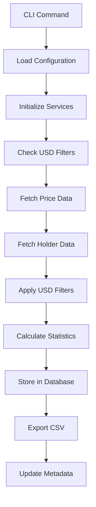
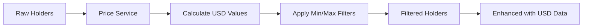
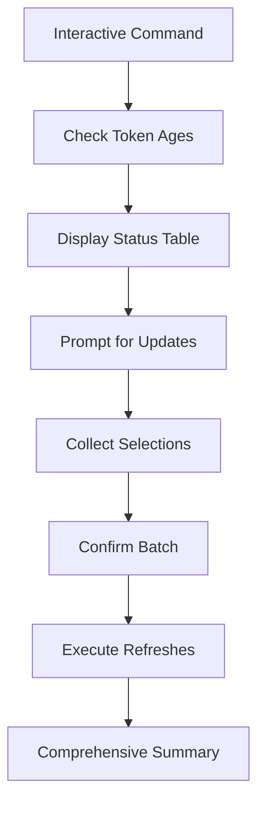

# Token Holdings System Architecture

## Overview

This system tracks token holder distributions on the Hedera network with SQLite storage, CSV export capabilities, USD-based filtering, and comprehensive CLI management.

## Architecture Principles

The system follows **SOLID principles** and **clean architecture** patterns:

- **Single Responsibility**: Each class/module has one clear purpose
- **Open/Closed**: Extensible through interfaces without modification
- **Liskov Substitution**: Pricing services are interchangeable via interfaces
- **Interface Segregation**: Small, focused interfaces (e.g., `PricingServiceInterface`)
- **Dependency Inversion**: High-level modules depend on abstractions

## System Components

### 1. Core Modules

```
src/
├── cli.py                    # Command-line interface (Click-based)
├── config.py                 # Configuration management
├── database/                 # Data persistence layer
│   ├── models.py            # SQLAlchemy models with USD support
│   ├── connection.py        # Database connection management
│   └── __init__.py
├── fetchers/                 # Data acquisition layer
│   ├── hedera_fetcher.py    # Hedera Mirror Node API client
│   └── __init__.py
├── services/                 # Business logic layer
│   ├── pricing_service.py   # SaucerSwap price integration
│   ├── token_filter_service.py # USD-based filtering logic
│   └── __init__.py
└── utils/                    # Utility functions
    ├── csv_export.py        # CSV export with file hashing
    ├── database_utils.py    # Database query helpers
    └── __init__.py
```

### 2. Database Schema

#### Core Tables

**token_metadata**: Token refresh metadata and USD pricing
- `token_symbol`, `token_id`: Token identification
- `last_refresh_*`: Refresh timestamps and status  
- `price_usd`, `tokens_per_usd`: Current pricing data
- `csv_filepath`, `csv_file_hash`: Export tracking

**token_holdings**: Individual holder records with rankings
- `account_id`, `balance`: Basic holder data
- `balance_rank`, `percentile_rank`: Statistical rankings
- `usd_value`, `price_usd_at_refresh`: USD value at time of refresh
- `is_top_holder`, `is_percentile_marker`: Classification flags

**token_price_history**: Historical price tracking
- `price_usd`, `tokens_per_usd`: Price data over time
- `source`: Price data source (saucerswap)

**refresh_logs**: Operation logging with USD filter tracking
- `operation`, `message`: Operation details
- `min_usd_filter`, `max_usd_filter`: Applied filters
- `processing_time_seconds`: Performance metrics

#### Optimized Indexes
- `idx_token_rank`: Fast ranking queries
- `idx_usd_value_desc`: USD value sorting
- `idx_token_price_time`: Historical price analysis

### 3. External API Integration

#### Hedera Mirror Node API
- **Rate Limiting**: 25 requests/second (conservative)
- **Retry Logic**: Exponential backoff with 429 handling
- **Pagination**: Automatic next-link following
- **Data Validation**: Decimal precision for balance parsing

#### SaucerSwap Pricing API  
- **Authentication**: API key-based (from appSettings.json)
- **Caching**: 5-minute price cache to minimize calls
- **Rate Monitoring**: Logs remaining API quota
- **Error Handling**: Graceful degradation when prices unavailable

## Data Flow

### 1. Token Refresh Process



### 2. USD Filtering Integration



### 3. Interactive Mode Flow



## Service Architecture

### Pricing Service Interface

```python
class PricingServiceInterface(ABC):
    @abstractmethod
    def get_token_price_usd(self, token_id: str) -> Optional[Decimal]:
        """Get USD price for a token."""
        
    @abstractmethod
    def get_tokens_for_usd_amount(self, token_id: str, usd_amount: Decimal) -> Optional[Decimal]:
        """Get number of tokens equivalent to USD amount."""
        
    @abstractmethod
    def refresh_price_cache(self) -> bool:
        """Refresh cached price data."""
```

### Service Dependencies

```
HederaTokenFetcher
├── SaucerSwapPricingService (composition)
├── TokenFilterService (composition)
└── Database Session (dependency injection)

TokenFilterService
└── PricingServiceInterface (dependency injection)
```

## Configuration Management

### Environment-Based Configuration
- **API Keys**: Loaded from `../../../frontend/appSettings.json`
- **Rate Limits**: Configurable in `config.py`
- **Token List**: External `tokens_enabled.json`

### Runtime Configuration
- **USD Features**: Enable/disable via CLI flags
- **Filter Thresholds**: Dynamic via command parameters
- **Account Limits**: Configurable per refresh

## Error Handling Strategy

### Graceful Degradation
1. **API Failures**: Continue without USD features
2. **Rate Limits**: Automatic retry with backoff
3. **Invalid Data**: Skip individual records, continue processing
4. **Network Issues**: Retry with exponential backoff

### Comprehensive Logging
- **Operation Logs**: Stored in database with metrics
- **Error Tracking**: Full error context with batch IDs
- **Performance Metrics**: Processing time and throughput

## Testing Strategy

### Unit Tests (27 tests)
- **Service Logic**: Pricing calculations, filtering algorithms
- **Database Models**: Schema validation, constraint testing
- **Error Handling**: Invalid data scenarios

### Integration Tests (1 test)
- **Real API**: Minimal SaucerSwap API calls
- **End-to-End**: Complete refresh workflow

### Test Organization
```
tests/
├── test_pricing_service.py      # SaucerSwap integration tests
├── test_filter_service.py       # USD filtering logic tests
├── test_database_models.py      # Schema and constraint tests
└── pytest.ini                   # Test configuration
```

## Performance Considerations

### Database Optimizations
- **Strategic Indexing**: Fast queries on common access patterns
- **Batch Inserts**: Efficient bulk data loading
- **Connection Pooling**: Managed database connections

### API Optimizations
- **Price Caching**: 5-minute cache reduces API calls
- **Rate Limiting**: Conservative limits prevent throttling
- **Pagination**: Efficient large dataset handling

### Memory Management
- **Streaming Processing**: Process data in chunks
- **Cleanup**: Automatic resource cleanup
- **Cache Expiry**: Prevent memory leaks

## Extension Points

### Adding New Pricing Sources
1. Implement `PricingServiceInterface`
2. Add configuration in `config.py`
3. Update service factory in `HederaTokenFetcher`

### Adding New Token Networks
1. Create network-specific fetcher
2. Implement common interface
3. Add configuration support

### Adding New Export Formats
1. Extend `utils/` with new export service
2. Add CLI options
3. Update database metadata tracking

## Security Considerations

### API Key Management
- **External Storage**: Keys stored outside codebase
- **Environment Variables**: Support for various deployment methods
- **Validation**: Key presence verification

### Data Integrity
- **File Hashing**: SHA-256 verification of exports
- **Batch Tracking**: UUID-based consistency verification
- **Transaction Management**: Atomic database operations

### Rate Limiting Compliance
- **Conservative Limits**: Well below API maximums
- **Respectful Retry**: Honor server retry-after headers
- **Monitoring**: Track usage to prevent violations